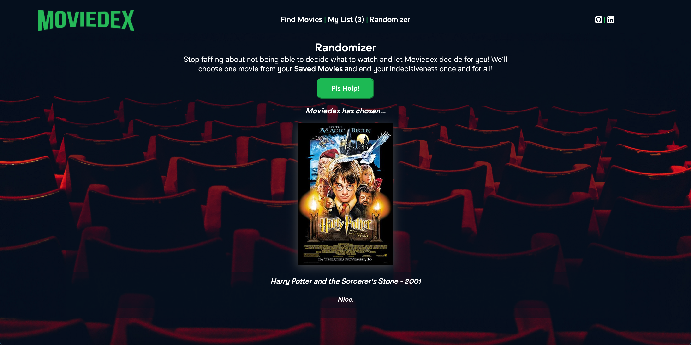

# Moviedex-Server

## Summary:
Moviedex-Server is a server-side build that supports a client side React web application, [Moviedex](https://github.com/zacharyjameson/moviedex-client). Moviedex-Server was deployed using Heroku.

## Method
* GET
* POST
* DELETE

## API URL Endpoints
* GET: /api/movies
* POST: /api/movies/:movie_id
* DELETE 1: /api/movies/:movie_id
* DELETE ALL: /api/movies

## URL Params
### Required
* s=[string || integer]

## Technology:
Moviedex was made using a server-side program that can be found here:
* [Moviedex-client](https://github.com/zacharyjameson/moviedex-client)

Technology Used:
* PostgreSQL
* Node.js
* Express
* Heroku

## Live Version:
[Moviedex](https://moviedex-client.vercel.app/)

## Screenshots

### Home Page

### Find Movies Page

### My List Page
 

### Randomizer Page

